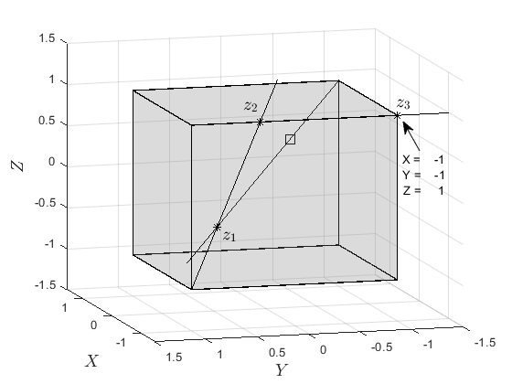

# FASTCONVEXCOMB

The algorithm is a novel approach for fast computation of convex combination coefficients based on
ray shooting. Such a problem arises in the real-time implementation of many set-based control techniques, which require a
computationally efficient solution to cope with high dimension or fast dynamics systems. The proposed method poses no
constraints on the polytope structure and requires only a list of vertices and boundary hyperplanes. The new method provided faster solutions in all cases, with speed-ups of up to ten-fold.

## Examples

 An example of usage of the script is given by [testConvexCombination.m](testConvexCombination.m)
 
 The example adopted a unitary cube to illustrate the algorithm working. 
 The algorithm sequence of ray-shoooting for the point point x = [ 0.2000  -0.3000    0.5000] is shown in the following figures
 
                  **Algorithm Ray-shooting Step 1  **                           **Algorithm Ray-shooting Step 2** 
                 
                   

**Algorithm Ray-shooting Step 3**          

                                              

As result the algorithm returnt the vertices and the coefficients of the convex combination

P.V(listV,:) = [
     1    -1     1
    -1     1    -1
    -1     1     1
    -1    -1     1] 
    
$$\lambda = [0.60 \; 0.25 \;0.10 \;   0.05]$$

## Installation

Add the path of the Main folder to the MATLAB Path

### Dependencies

External dependencies of FastConvexComb are:

1. MPT3 ([https://www.mpt3.org/](https://www.mpt3.org/))

