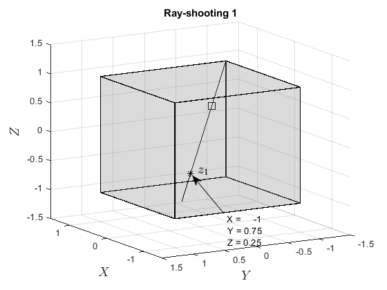

# FASTCONVEXCOMB

The algorithm is a novel approach for fast computation of convex combination coefficients based on
ray shooting. Such a problem arises in the real-time implementation of many set-based control techniques, which require a
computationally efficient solution to cope with high dimension or fast dynamics systems. The proposed method poses no
constraints on the polytope structure and requires only a list of vertices and boundary hyperplanes. The new method provided faster solutions in all cases, with speed-ups of up to ten-fold.

## Examples

 An example of usage of the script is given by [testConvexCombination.m](testConvexCombination.m)
 
                 Algorithm Ray-shooting Step 1               |               Algorithm Ray-shooting Step 1 
                 
              

  

 Algorithm Ray-shooting Step 1 

## Installation

Add the path of the Main folder to the MATLAB Path

### Dependencies

External dependencies of FastConvexComb are:

1. MPT3 ([https://www.mpt3.org/](https://www.mpt3.org/))

