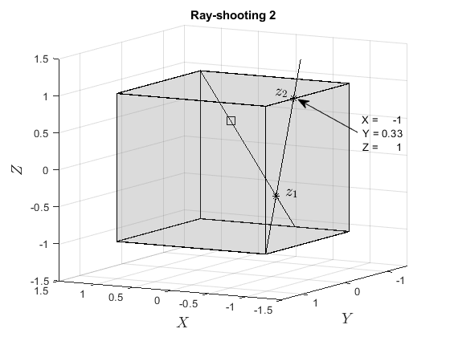

# FASTCONVEXCOMB
## Description
<center>
The algorithm is a novel approach for fast computation of convex combination coefficients based on
ray shooting. Such a problem arises in the real-time implementation of many set-based control techniques, which require a
computationally efficient solution to cope with high dimension or fast dynamics systems. The proposed method poses no
constraints on the polytope structure and requires only a list of vertices and boundary hyperplanes. The new method provided faster solutions in all cases, with speed-ups of up to ten-fold.
</center>


## Installation

Add the path of the Main folder to the MATLAB Path

### Dependencies

External dependencies of FastConvexComb are:

1. MPT3 ([https://www.mpt3.org/](https://www.mpt3.org/))

## Example

 An usage example of the script is given by [testConvexCombination.m](testConvexCombination.m)
 
 The example adopted a unitary cube to illustrate the algorithm working. 
 The algorithm sequence of ray-shoooting for the point 
 x = [ 0.2000  -0.3000    0.5000] is shown in the following figures
 
                 
                   
   
<p align="center">

</p>

As result, the algorithm returns the vertices and the coefficients of the convex combination

<p align="center">

</p>

## License

The fast method for obtaining convex combination coefficients is free software: you can
redistribute it and/or modify it under the terms of the GNU General Public
License as published by the Free Software Foundation, either version 3 of the
License, or (at your option) any later version.

This program is distributed in the hope that it will be useful, but WITHOUT ANY
WARRANTY; without even the implied warranty of MERCHANTABILITY or FITNESS FOR A
PARTICULAR PURPOSE.  See the GNU General Public License for more details.  You
should have received a copy of the GNU General Public License along with this
toolbox (see [LICENSE](./LICENSE)).  If not, see
<https://www.gnu.org/licenses/>.

It is the user's responsibility in assessing the correctness of the theory and
software implementation before putting it to use in their own research or
exploiting the results commercially. We are, however, very happy to answer any
questions and investigate any bug reports.

## Credits

This tools presented here were developed by
[Roberto K. H. Galvão](http://www.ele.ita.br/~kawakami/), 
[João Paulo Vieira]() and
[Rubens J. M. Afonso](http://www.ita.br/~rubens).

If this tools comes handy in your research, please consider citing our
work.

IEEE citation style:

> J. P. Vieira, R. K. H. Galvão and R. J. M. Afonso.  "A fast method for obtaining convex combination coefficients," In Automatica, December 16--18, 2023.
    
BibTeX entry: 
```
@article{VIEIRAGALVAOAFONSO2023,
title = {A fast method for obtaining convex combination coefficients},
journal = {Automatica},
volume = {},
pages = {},
year = {2023},
issn = {},
doi = {},
url = {},
author = {J. P. Vieira, R. K. H. Galvão and R. J. M. Afonso. },
```
